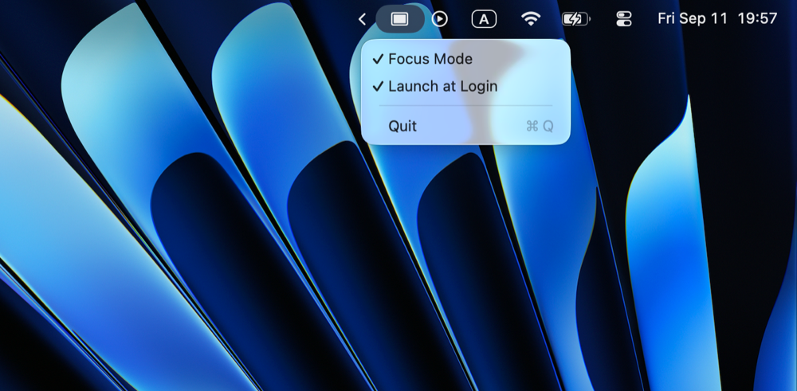

# ActiveWindow

Menu bar app for macOS. When Focus Mode is on, it hides every other application
each time you switch to a new application. This is the same effect as Cmd+Option+H,
applied automatically.

## Demo

Focus Mode on: switch to an app, every other app hides.


Focus Mode off: windows of other apps stay on screen.


## Install

1. Download `ActiveWindow.dmg` from the [latest release](https://github.com/nick318/active-window/releases/latest).
2. Open the image and drag ActiveWindow to the Applications shortcut.
3. Open ActiveWindow from Applications. It appears in the menu bar.

The app is signed with a Developer ID and notarized by Apple. macOS 13 or later.

## Use

The app has no window. The menu bar icon is the only interface.



Click the menu bar icon.

- **Focus Mode** turns the behavior on or off. The setting persists between launches.
- **Launch at Login** registers the app as a login item.
- **Quit** exits the app.

## Build from source

Requires Xcode command line tools.

```sh
git clone https://github.com/nick318/active-window.git
cd active-window
./build-app.sh
open dist/ActiveWindow.app
```

`build-app.sh` compiles the Swift package and creates `dist/ActiveWindow.app`.
It signs the app with the first "Developer ID Application" identity in your keychain,
or with an ad-hoc signature if none exists. Set `CODESIGN_IDENTITY` to choose another
identity. Copy the app to `/Applications` if you want **Launch at Login** to survive
a `dist` cleanup.

### Build the DMG

```sh
./make-dmg.sh
```

This creates `dist/ActiveWindow.dmg`, a drag-and-drop image with the app and an
Applications shortcut. The image is signed with the same identity as the app.

### Notarize

`make-dmg.sh` notarizes the app and the image when credentials are present, and
staples the tickets. Provide an App Store Connect API key:

```sh
NOTARY_ISSUER_ID=<issuer uuid> ./make-dmg.sh
```

`NOTARY_KEY_PATH` defaults to the first `AuthKey_*.p8` in `~/.private_keys`, and
`NOTARY_KEY_ID` is derived from that file name. Or use a keychain profile saved with
`xcrun notarytool store-credentials`:

```sh
NOTARY_PROFILE=<profile name> ./make-dmg.sh
```

Set `NOTARIZE=0` to skip notarization.

## Notes

- No Accessibility permission is needed. The app uses `NSRunningApplication.hide()`.
- Only applications with a Dock icon are hidden. Menu bar helpers and Spotlight are not affected.
- Windows of the same application are not separated. macOS hides applications, not single windows.
