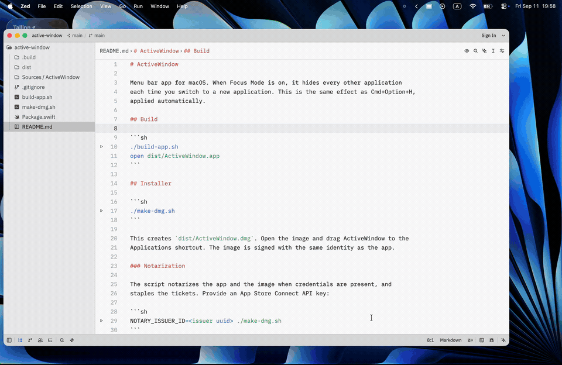
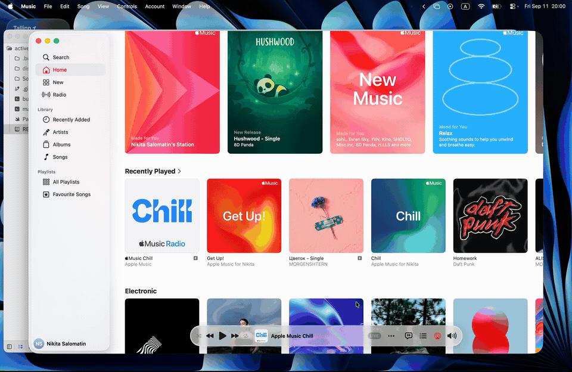

# ActiveWindow

Menu bar app for macOS. When Focus Mode is on, it hides every other application
each time you switch to a new application. This is the same effect as Cmd+Option+H,
applied automatically.

## Demo

Focus Mode on: switch to an app, every other app hides.



Focus Mode off: windows of other apps stay on screen.



## Build

```sh
./build-app.sh
open dist/ActiveWindow.app
```

## Installer

```sh
./make-dmg.sh
```

This creates `dist/ActiveWindow.dmg`. Open the image and drag ActiveWindow to the
Applications shortcut. The image is signed with the same identity as the app.

### Notarization

The script notarizes the app and the image when credentials are present, and
staples the tickets. Provide an App Store Connect API key:

```sh
NOTARY_ISSUER_ID=<issuer uuid> ./make-dmg.sh
```

`NOTARY_KEY_PATH` defaults to the first `AuthKey_*.p8` in `~/.private_keys`, and
`NOTARY_KEY_ID` is derived from that file name. Or use a keychain profile saved with
`xcrun notarytool store-credentials`:

```sh
NOTARY_PROFILE=<profile name> ./make-dmg.sh
```

Set `NOTARIZE=0` to skip notarization.

The app appears in the menu bar. Click the icon and toggle **Focus Mode**.
The setting persists between launches.

**Launch at Login** registers the app as a login item. Keep the app bundle in a
stable location, for example `/Applications`, because the login item points to
the bundle path.

The build script signs the app with the first "Developer ID Application" identity in
your keychain, or with an ad-hoc signature if none exists. Set `CODESIGN_IDENTITY`
to choose another identity.

## Notes

- No Accessibility permission is needed. The app uses `NSRunningApplication.hide()`.
- Only applications with a Dock icon are hidden. Menu bar helpers and Spotlight are not affected.
- Windows of the same application are not separated. macOS hides applications, not single windows.
